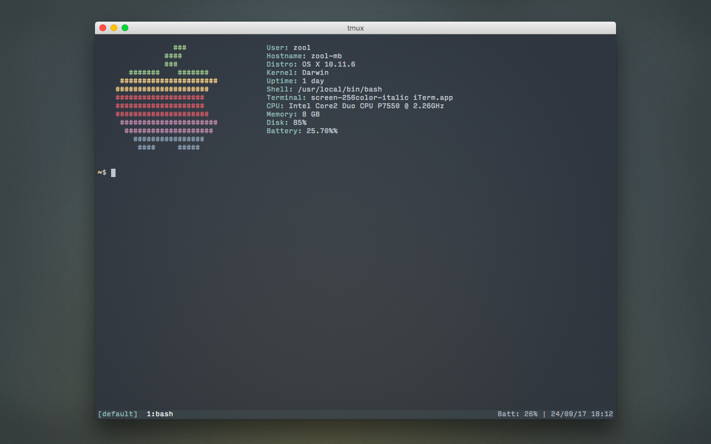

# zool's dotfiles

Config files for my \*nix systems.

- **Current OS**: Mac OS X 10.11 "El Capitan"
- **Terminal**: [iTerm2](https://www.iterm2.com/)
- **Color scheme**: [Base16](https://github.com/chriskempson/base16) (dark ocean variant)
- **Typeface**: [Input](http://input.fontbureau.com/) by [Font Bureau](http://www.fontbureau.com/)
- **Desktop wallpaper**: [Flavoured](http://digitalshiva.deviantart.com/art/Flavoured-121784194) by Tkui (my default since 2009!)

This repo includes dotfiles for Bash, Readline, Vim, tmux, Git, Mutt, newsbeuter, mpd/ncmpcpp, and lots more.

Managed with [GNU Stow](https://www.gnu.org/software/stow/) (read more about it [here](http://brandon.invergo.net/news/2012-05-26-using-gnu-stow-to-manage-your-dotfiles.html)).

A thread about this config is available on [/r/unixporn](https://www.reddit.com/r/unixporn/comments/3ddudy/os_x_vimtmux_setup/).

## License

[MIT](https://opensource.org/licenses/MIT)
